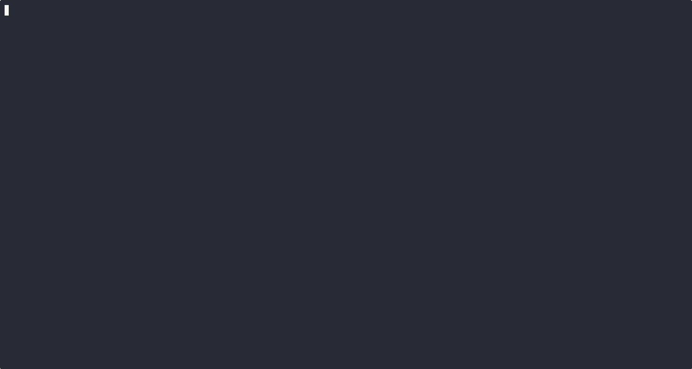

# ic0bra
Extension to the cobra library to allow an interactive walk through a cli tool start configuration.

As additional feature the library allows to include a history for configured flags.

**Attention**, this library only works for programs using cobra commands with sub commands!

# Usage

## Normal interactive mode

1. declare your root command as you get used to
2. connect the sub commands
3. include in the `Run` method of your root command the call of `RunInteractive` [example](./_examples/simple/main.go#L16)

## Interactive mode with history for flags

1. declare your root command as you get used to
2. connect the sub commands
3. include in the `Run` method of your root command the call of `RunInteractiveWithHistory` [example](./_examples/history/main.go#L16)

The history is stored in files under the user config directory (Linux: ~/.config). There a
folder for the application name is created and then the previous input for the flags
is stored in files like: `{USER_CONFIG_DIR}/{APP_NAME}/history/{FLAG_NAME}.hist`
